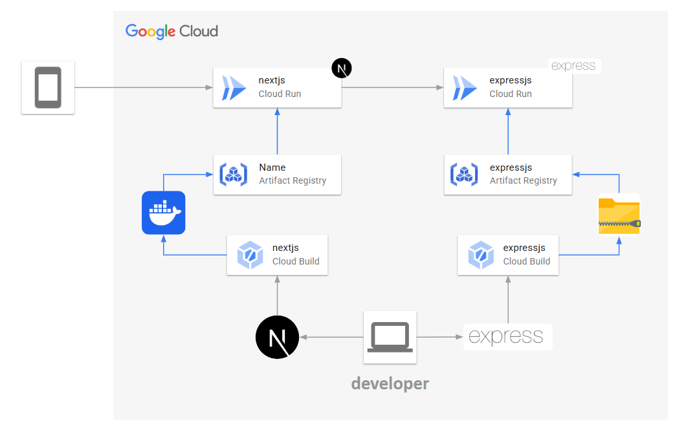

# Google Cloud Platform Serverless Demo
This is a simple demo serverless deployment on Google Cloud Platform with Cloud Run. This is a part of GCP event at KMITL Bangkok 2025

This project will show how to deploy frontend to backend with container and source code.

## Architect



## Prerequisite

- Google Cloud Plaform Account
- Project with linked billing
- gcloud cli

# How to use

- Frontend deployment
    ```bash
    make deploy-frontend
    ```

- Backend deployment
    ```bash
    make deploy-backend
    ```

## CLI Reference

- `--source`
    The location of the source to build. If a Dockerfile is present in the source code directory, it will be built using that Dockerfile, otherwise it will use Google Cloud buildpacks. See https://cloud.google.com/run/docs/deploying-source-code for more details. The location can be a directory on a local disk or a gzipped archive file (.tar.gz) in Google Cloud Storage. If the source is a local directory, this command skips the files specified in the --ignore-file. If --ignore-file is not specified, use .gcloudignore file. If a .gcloudignore file is absent and a .gitignore file is present in the local source directory, gcloud will use a generated Git-compatible .gcloudignore file that respects your .gitignored files. The global .gitignore is not respected. For more information on .gcloudignore, see gcloud topic gcloudignore.

#### Documentation
- [Google Cloud CLI](https://cloud.google.com/sdk/gcloud/reference/run/deploy)
- [Cloud Run](https://cloud.google.com/run?hl=en)